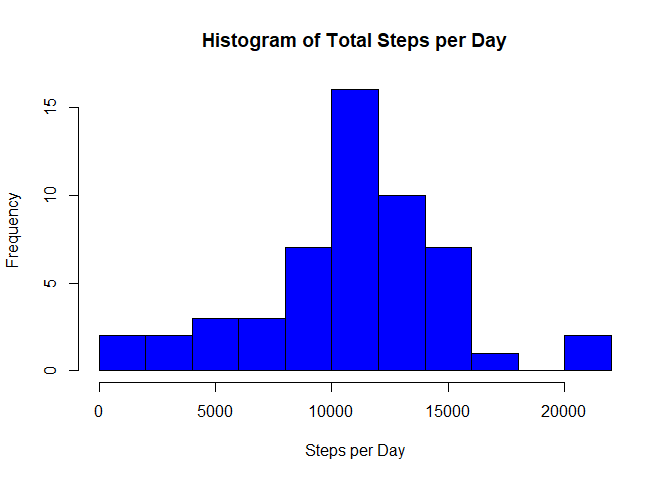
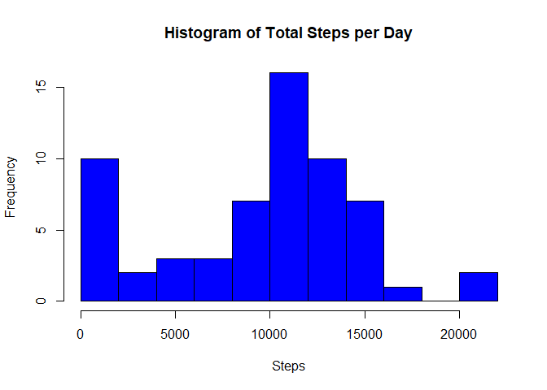
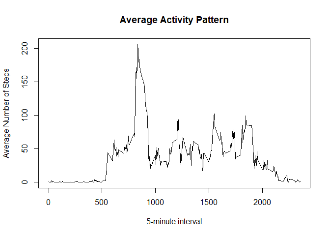
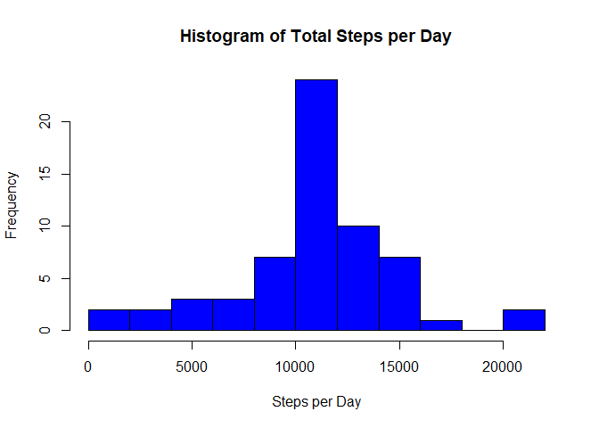

## Loading and preprocessing the data

```r
library(dplyr, quietly = TRUE, warn.conflicts = FALSE)
td = tempdir()
tf = paste(td, "\\activity.zip", sep = "")
link = "https://github.com/cszpara/RepData_PeerAssessment1/blob/master/activity.zip?raw=true"
download.file(link, tf, mode = "wb", cacheOK = FALSE, quiet = TRUE)
unzip(tf, files = "activity.csv", exdir = td, overwrite = TRUE)
dfClass = c("numeric", "Date", "numeric")
df = read.csv(paste(td, "\\activity.csv", sep = ""), 
                colClasses = dfClass,
                stringsAsFactors = FALSE)
```


## What is mean total number of steps taken per day?

```r
daily = aggregate(steps ~ date, df, sum) 
with(daily, hist(steps, breaks = 10, col = "blue", 
                 main = "Histogram of Total Steps per Day",
                 xlab = "Steps per Day"))
```

<!-- -->

```r
dailymean = as.integer(mean(daily$steps, na.rm = TRUE))
dailymedian = as.integer(median(daily$steps, na.rm = TRUE))
```
The steps per day mean is 10766, and the steps per day median is 10765.

Please note that days with NA have been removed rather than represented by 0 steps such as occurred on 2012-10-01 and 2012-10-08. If they were included the mean and median would shift down.


```r
daily.2 = df %>% group_by(date) %>% summarize(steps = sum(steps, na.rm = TRUE))
with(daily.2, hist(steps, breaks = 10, col = "blue", 
                 main = "Histogram of Total Steps per Day",
                 xlab = "Steps"))
```

<!-- -->

```r
dailymean.2 = as.integer(mean(daily.2$steps, na.rm = TRUE))
dailymedian.2 = as.integer(median(daily.2$steps, na.rm = TRUE))
```
Using 0 steps on days with NA will yield the following results:

The steps per day mean is 9354, and the steps per day median is 10395.

## What is the average daily activity pattern?

```r
avg.pattern = aggregate(steps ~ interval, df, mean) 
with(avg.pattern, plot(interval, steps, type = "l", 
              main = "Average Activity Pattern",
              xlab = "5-minute interval",
              ylab = "Average Number of Steps"))
```

<!-- -->


```r
max = as.integer(max(avg.pattern$steps))
max.interval = avg.pattern[which.max(avg.pattern$steps), "interval"]
```
The average maximum steps across the days is 206, which occurs at the 835 interval.

## Imputing missing values

```r
df.na = sum(is.na(df$steps))
```
There are 2304 intervals that are NA.

To imput missing values, we will use the mean for specified interval.

```r
df.imputed = df
for(i in 1:nrow(avg.pattern)){
  required = is.na(df.imputed$steps) & df.imputed$interval == avg.pattern[i, "interval"]
  df.imputed[required, "steps"] = avg.pattern[i, "steps"]
}
```


```r
daily.imputed = aggregate(steps ~ date, df.imputed, sum) 
with(daily.imputed, hist(steps, breaks = 10, col = "blue", 
                 main = "Histogram of Total Steps per Day",
                 xlab = "Steps per Day"))
```

<!-- -->

```r
dailymean.imputed = as.integer(mean(daily.imputed$steps, na.rm = TRUE))
dailymedian.imputed = as.integer(median(daily.imputed$steps, na.rm = TRUE))
```
When NA's are imputed, the steps per day mean is 10766, and the steps per day median is 10766.

The previous values without NA's imputed were: mean 10766; median 10765

The previous values without NA's imputed and NA days counted as zero were: mean 9354; median 10395

Based on these result, imputed values did not influence the daily total averages when NA days where eliminated. If NA days are included as 0 steps, the daily total is increased when values are imputed.

## Are there differences in activity patterns between weekdays and weekends?

```r
df.imputed$day = weekdays(df.imputed$date)
day = c("Saturday", "Sunday", "Monday", "Tuesday", 
        "Wednesday", "Thursday", "Friday")
wknd.wkdy = c(rep("Weekend", 2), rep("Weekday", 5))
wknd.wkdy = data.frame(day, wknd.wkdy)
df.imputed = merge(df.imputed, wknd.wkdy, by.x = "day", by.y = "day")

avg.pattern = aggregate(steps ~ interval + wknd.wkdy, df.imputed, mean)
library(lattice, quietly = TRUE, warn.conflicts = FALSE)
xyplot(steps ~ interval | wknd.wkdy, data = avg.pattern,
       layout = c(1, 2), type = "l")
```

<!-- -->
